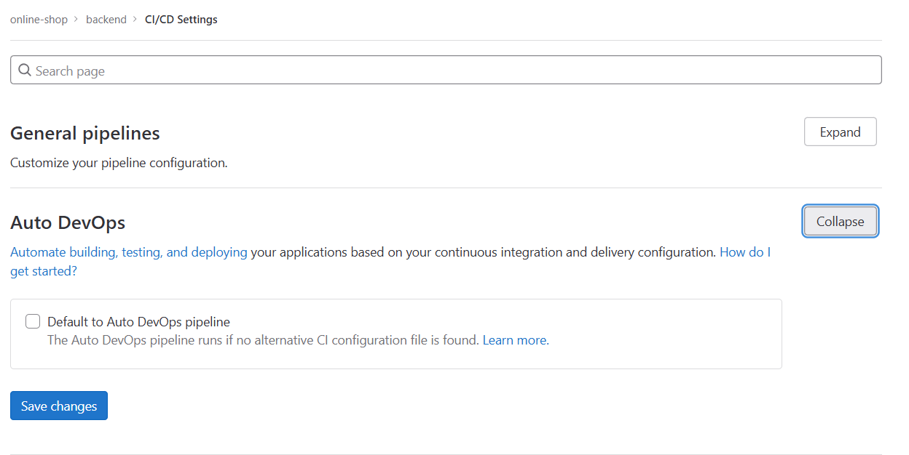
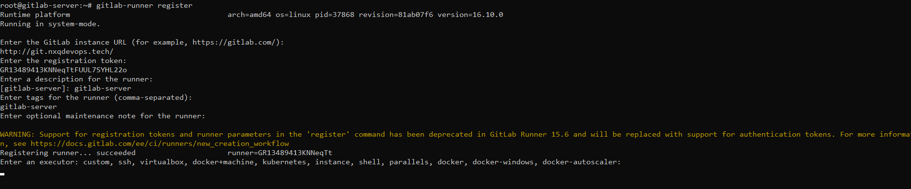
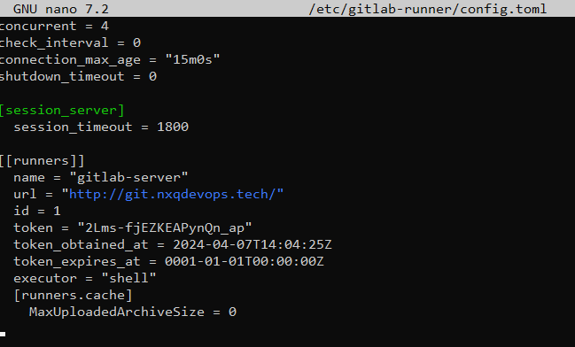

# Quy trình thứ nhất 

## I. Giới thiệu
Trong quy trình đầu tiên này, ta sẽ thiết lập một môi trường CI/CD cơ bản sử dụng gitlab và gitlab-runner.

Ta sẽ triển khai 2 server đó là gitlab-server có nhiệm vụ lưu trữ code và dev-server là server được cài đặt môi trường development và gitlab-runner

## II. Triển khai
### 1. Setup cho gitlab-server

### 2. Setup cho dev-server
#### Cài đặt gitlab-runner cho server triển khai dự án.
```bash
#
apt update -y
#
curl -L "https://packages.gitlab.com/install/repositories/runner/gitlab-runner/script.deb.sh" | sudo bash
# 
apt install gitlab-runner
```

Tắt `auto DevOps` cho các dự án backend và frontend

#### Gitlab-runner có user là gitlab-runner

thiết lập CI/CD

URL và token được lấy trong setting của CICD/runners trên remote
> Chú ý, phần tag và description có thể đổi tên tùy theo ý thích



ở phần enter an excutor bên trên: đây là phần lựa chọn cách chạy, trực tiếp trên server hoặc sử dụng docker hay kubernetes

###### Khi các config bên trên hoàn thành, config sẽ được lưu ở file /etc/gitlab-runner/config.toml

Thuộc tính concurrent chính là số lượng pipeline có thể chạy đồng thời


### 3. CI/CD

#### Dự án backend-dotnet


Tạo branch riêng cho các lần cicd
VD: pipeline-be-1
Tạo file `.gitlab-ci.yml`

```yaml
variables: 
    USER_PROJECT: "onlineshop"
    PATH_PROJECT: "/home/${USER_PROJECT}/${CI_PROJECT_NAME}"
stages:
    - build
    - deploy
build:
    stage: build
    variables:
        GIT_STRATEGY: clone
    script:
        - dotnet restore
    tags:
        - online-shop-runner-dev-shell
    only:
        - tags
deploy:
    stage: deploy
    variables:
        GIT_STRATEGY: none
    script:
        - |
          pid =$(sudo netstat -tupln | grep :5214 | awk '{print $7}' | cut -d '/' -f1) || true
          if [ -n "$pid" ]; then
            sudo kill -9 ${pid}
          fi
        - sudo cp -rf * ${PATH_PROJECT}
        - sudo chown -R ${USER_PROJECT}. ${PATH_PROJECT}
        - sudo su ${USER_PROJECT} -c "cd ${PATH_PROJECT}; nohup dotnet run > log.txt 2>&1 &"
    tags:
        - online-shop-runner-dev-shell ## cần đặt tag trùng với tên của runner
    only:
        - tags

```
*GIT_STRATEGY: clone* : clone code trên git về
*GIT_STRATEGY: none*  : Không clone code về
```yaml
    - |
        pid =$(sudo netstat -tupln | grep :5214 | awk '{print $7}' | cut -d '/' -f1) || true
        if [ -n "$pid" ]; then
            sudo kill -9 ${pid}
        fi 
    # kill dự án backend nếu đang chạy
  tags:
        - online-shop-runner-dev-shell # runner đang chạy pipeline này
  only:
        - tags  #chỉ chạy pipeline khi có tag được thêm vào
```

### Dự án frontend -react

```yaml
variables: 
    USER_PROJECT: "onlineshop"
    PATH_PROJECT: "/home/${USER_PROJECT}/${CI_PROJECT_NAME}"
stages:
    - build
    - deploy
build:
    stage: build
    variables:
        GIT_STRATEGY: clone
    script:
        - npm install --force
    tags:
        - online-shop-runner-dev-shell
    only:
        - tags
deploy:
    stage: deploy
    variables:
        GIT_STRATEGY: none
    script:
        - sudo cp -rf * ${PATH_PROJECT}
        - sleep 5
        - sudo chown -R ${USER_PROJECT}. ${PATH_PROJECT}
        - sudo su ${USER_PROJECT} -c "cd ${PATH_PROJECT}; pm2 delete ${CI_PROJECT_NAME}};nohup pm2 start npm --name ${CI_PROJECT_NAME}} -- run 'start'"
    tags:
        - online-shop-runner-dev-shell ## cần đặt tag trùng với tên của runner
    only:
        - tags
```
Dự án sử dụng pm2 để chạy react
