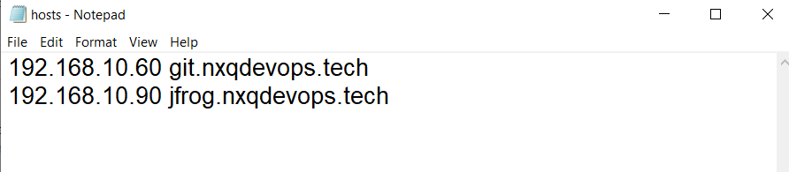

# Quy trình thứ hai

- [Quy trình thứ hai](#quy-trình-thứ-hai)
  - [I. Giới thiệu](#i-giới-thiệu)
  - [II. Triển khai](#ii-triển-khai)
    - [1. Cài đặt công cụ](#1-cài-đặt-công-cụ)
      - [1.1: Trên artifactory](#11-trên-artifactory)
        - [a. Cài đặt `Docker`](#a-cài-đặt-docker)
        - [b. Cài đặt image jfrog](#b-cài-đặt-image-jfrog)
        - [c. Kiểm tra trạng thái của container](#c-kiểm-tra-trạng-thái-của-container)
          - [Sửa lỗi](#sửa-lỗi)
        - [d. Thiết lập jfrog](#d-thiết-lập-jfrog)
        - [e. Thiết lập repository cho dự án](#e-thiết-lập-repository-cho-dự-án)
      - [1.2 Cài đặt gitlab-runner trên build server](#12-cài-đặt-gitlab-runner-trên-build-server)
    - [2.Triển khai dự án](#2triển-khai-dự-án)
      - [2.1 Triển khai dự án backend](#21-triển-khai-dự-án-backend)
      - [2.2 Triển khai dự án front-end](#22-triển-khai-dự-án-front-end)

## I. Giới thiệu

Trong quy trình thứ nhất, khi chạy pipeline, các bước như run build giống hệt nhau sẽ lại được tái kích hoạt và pipeline sau sẽ xóa toàn bộ kết quả của pipeline trước. Gây tốn tài nguyên cũng như bộ nhớ. Điều này cũng gây ra khó khăn cho việc đối chiếu hiệu năng giữa các phiên bản update, khó rollback lại.

Để giải quyết vấn đề này người ta đưa ra phương pháp

Khi chúng ta build xong, phiên bản sẽ được lưu trữ trên artifactory. Khi cần chạy phiên bản nào ta sẽ kéo phiên bản đó về server để chạy.

Trong quy trình này, ta cũng có `2 cách`:

- Cách thứ nhất mỗi server build và run đều phải cần cài đặt runner

- Cách thứ hai, ở bước deploy chúng ta sẽ sử dụng các công cụ khác như `ansible, puppet hay terraform`. (Các này yêu cầu kiến thức hệ thống tốt và phân quyền đúng đắn)

## II. Triển khai

> Trong bài học, đầu tiên chúng ta phải tạo ra 2 server là build-server và artifactory.
> Build-server có vai trò là một runner chịu trách nhiệm build dự án và đóng gói dự án sau đó đẩy dự án lên một nơi lưu trữ artifact. Ở đây ta sử dụng artifactory làm nơi lưu trữ này
> Artifactory sẽ đóng vai trò là nơi lưu trữ các phiên bản artifact. Để làm được điều này, ta cần cài đặt một công cụ, đó là Jfrog.
> Cuối cùng, dự án của bạn sẽ được triển khai ở dev-server, tương tự quy trình một. Nhưng thay vì việc pull code và build ở dev-server như quy trình một, ta chỉ cần pull artifact từ artifactory(Jfrog) và chạy dự án vừa pull về.

### 1. Cài đặt công cụ

#### 1.1: Trên artifactory

##### a. Cài đặt `Docker`

```bash
sudo apt install docker.io -y
```

##### b. Cài đặt image jfrog

```bash
## tạo thư mục làm việc cho jfrog
mkdir -p /tools/jfrog/data
## pull images
docker run --name artifactory-jfrog --restart unless-stopped -v /tools/jfrog/data/:/var/opt/jfrog/artifactory -d -p 8081:8081 -p 8082:8082 releases-docker.jfrog.io/jfrog/artifactory-oss:7.77.5
```

##### c. Kiểm tra trạng thái của container


Ta có thể thấy trạng thái đang là _Restarting(1)_

###### Sửa lỗi

```bash
docker logs artifactory-jfrog
```

Lỗi hiển thị ra

Đây là lỗi không đủ quyền cho nhóm người dùng 1030

```bash
## cấp quyền cho nhóm người dùng 1030
chown -R 1030:1030 /tools/jfrog
## restart container jfrog
docker restart artifactory-jfrog
```

Trong file hosts của máy Windows: sửa file hosts có nội dung như sau


##### d. Thiết lập jfrog

Truy cập vào jfrog bằng port hoặc domain được add trong file hosts

`User và password` mặc định của web là admin và password

> Xem thông tin tại [Jfrog install by docker ](https://jfrog.com/help/r/jfrog-installation-setup-documentation/install-artifactory-single-node-with-docker)

Reverse proxy bằng nginx

```bash
## download nginx
apt install nginx -y
## thay đổi file cấu hình mặc định của nginx
nano /etc/nginx/sites-available/default
```

Thay đổi thành nội dung bên dưới

Tạo file reverse proxy cho jfrog

```bash
nano /etc/nginx/conf.d/jfrog.nxqdevops.tech.conf
```

Nội dung file

> Chú ý: giống như bên gitlab, bạn có thể tùy chọn tên domain cho jfrog tùy theo ý thích

```conf
server {
        listen 80;
        server_name jfrog.nxqdevops.tech;

        location / {
                proxy_set_header X-Real-IP $remote_addr;
                proxy_set_header X-Forwarded-For $proxy_add_x_forwarded_for;
                proxy_set_header Host $http_host;
                proxy_pass http://192.168.10.90:8082/;
                proxy_redirect off;
        }
}
```

Ta cần tăng dung lượng đến cho artifactory, để code được gửi lên đầy đủ nhất

```
nano /etc/nginx/nginx.conf
# nội dung cần thêm vào
# có thể tăng dung lượng lên nếu code quá nhiều
http {
    client_max_body_size 20M;
    ...
}
```

```bash
#Khởi động lại nginx
systemctl restart nginx
```

Sau khi reverse proxy, chúng ta đã có thể truy cập jfrog mà không cần phải điền port trong đường dẫn


Sửa đường dẫn trong page jfrog


##### e. Thiết lập repository cho dự án

Tại repository tạo repo cho dự án

Chọn generic

_Tạo user online-shop và gán quyền cho user vào dự án_
Tạo quyền cho trong phần permission


Lưu lại và ta hãy đăng nhập lại bằng tài khoản online-shop


#### 1.2 Cài đặt gitlab-runner trên build server

Bước đầu tiên, ta cần add host của jfrog vào build-server, điều này cũng cần trong cả dev-server.

```bash
nano /etc/hosts
# cú pháp để thêm host là
# ipv4 domain
```

Ta cài đặt gitlab-runner và thêm runner vào gitlab tương tự như dev-server với tag là online-shop-runner-build-shell(hoặc tùy theo ý bạn)

### 2.Triển khai dự án

Trước tiên ta cần thêm một số variables toàn cục cho dự án.
Trong phần CI/CD của group ta thêm các variable:

- `ARTIFACT_USER`: là tên user mình vừa tạo của jfrog
- `ARTIFACT_PASS`: là mật khẩu của user trên
- `ARTIFACT_URL` : là đường dẫn đến file

#### 2.1 Triển khai dự án backend

Tạo branch pipeline-be-2 từ nhanh pipeline-be-1
Thay đổi file ci/cd

```yml
variables:
  USER_PROJECT: "onlineshop"
  PATH_PROJECT: "/home/${USER_PROJECT}/${CI_PROJECT_NAME}"
  ZIP_VERSION: "${CI_PROJECT_NAME}-$CI_COMMIT_SHORT_SHA-$CI_COMMIT_TAG.zip"
stages:
  - build
  - push
  - deploy
build:
  stage: build
  variables:
    GIT_STRATEGY: clone
  script:
    - dotnet restore
    - zip -r $ZIP_VERSION .
  tags:
    - online-shop-runner-build-shell
  only:
    - tags
push:
  stage: push
  variables:
    GIT_STRATEGY: none
  script:
    - curl -X PUT -u $ARTIFACT_USER:$ARTIFACT_PASS -T $ZIP_VERSION "$ARTIFACT_URL/$ZIP_VERSION"
  tags:
    - online-shop-runner-build-shell
  only:
    - tags
deploy:
  stage: deploy
  variables:
    GIT_STRATEGY: none
  script:
    - sudo su ${USER_PROJECT} -c "cd ${PATH_PROJECT}; rm -rf *;curl -u $ARTIFACT_USER:$ARTIFACT_PASS -O $ARTIFACT_URL/$ZIP_VERSION; ls;unzip -o $ZIP_VERSION"
    - |
      pid =$(sudo netstat -tupln | grep :5214 | awk '{print $7}' | cut -d '/' -f1) || true
      if [ -n "$pid" ]; then
        sudo kill -9 ${pid}
      fi
    - sudo su ${USER_PROJECT} -c "cd ${PATH_PROJECT}; nohup dotnet run > log.txt 2>&1 &"
  tags:
    - online-shop-runner-dev-shell
  only:
    - tags
```

Để pipeline chạy, ta chỉ cần tạo thêm tag trong gitlab và ngồi chờ pipeline chạy xong

#### 2.2 Triển khai dự án front-end

Tương tự như backend, ta tạo thêm 1 branch nữa cho quy trình 2: pipeline-fe-2

Thay đổi file ci/cd

```yml
variables:
  USER_PROJECT: "onlineshop"
  PATH_PROJECT: "/home/${USER_PROJECT}/${CI_PROJECT_NAME}"
  ZIP_VERSION: "${CI_PROJECT_NAME}-$CI_COMMIT_SHORT_SHA-$CI_COMMIT_TAG.zip"
stages:
  - build
  - push
  - deploy
build:
  stage: build
  variables:
    GIT_STRATEGY: clone
  script:
    - npm install --force
    - zip -r $ZIP_VERSION .
  tags:
    - online-shop-runner-build-shell
  only:
    - tags
push:
  stage: push
  variables:
    GIT_STRATEGY: none
  script:
    - curl -X PUT -u $ARTIFACT_USER:$ARTIFACT_PASS -T $ZIP_VERSION "$ARTIFACT_URL/$ZIP_VERSION"
  tags:
    - online-shop-runner-build-shell
  only:
    - tags
deploy:
  stage: deploy
  variables:
    GIT_STRATEGY: none
  script:
    - sudo chown -R ${USER_PROJECT}. ${PATH_PROJECT}
    - sudo su ${USER_PROJECT} -c "cd ${PATH_PROJECT}; rm -rf *;curl -u $ARTIFACT_USER:$ARTIFACT_PASS -O $ARTIFACT_URL/$ZIP_VERSION; ls;unzip -o $ZIP_VERSION;ls;pwd"
    - sleep 5
    - sudo su ${USER_PROJECT} -c "cd ${PATH_PROJECT}; pm2 delete ${CI_PROJECT_NAME};nohup pm2 start npm --name ${CI_PROJECT_NAME} -- run 'start'"
  tags:
    - online-shop-runner-dev-shell
  only:
    - tags
```
